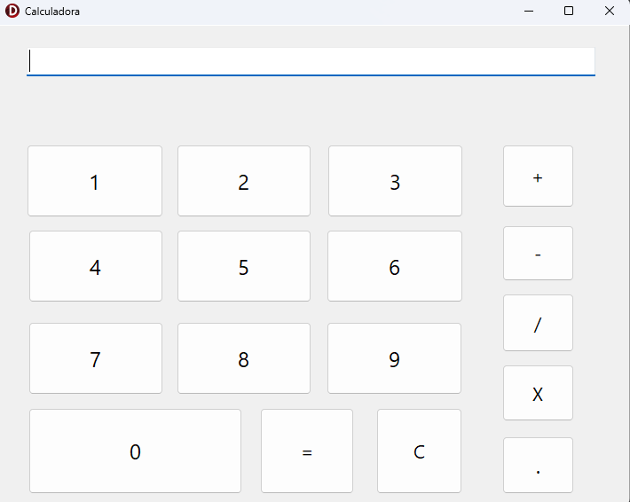

# Calculadora em Delphi

Projeto simples de uma calculadora desenvolvida em Delphi utilizando VCL Forms.
O objetivo do projeto é praticar lógica de programação, manipulação de eventos e operações matemáticas básicas.

## Funcionalidades

A calculadora possui as seguintes operações:

* Soma
* Subtração
* Multiplicação
* Divisão
* Entrada de números de 0 a 9
* Ponto decimal
* Limpar display
* Tratamento de erro para divisão por zero

## Interface

A aplicação possui:

* Um campo de display (TEdit) para mostrar os números e resultados
* Botões para números de 0 a 9
* Botões para operações matemáticas
* Botão de igual (=)
* Botão para limpar o display

## Lógica de funcionamento

O programa utiliza três variáveis principais:

```delphi
Numero, Numero1: Real;
Operacao: Char;
```

* Numero armazena o primeiro valor digitado
* Numero1 armazena o segundo valor digitado
* Operacao armazena a operação escolhida (+, -, * ou /)

Quando o usuário pressiona o botão de igual, o programa executa a operação utilizando uma estrutura `case`.

Exemplo:

```delphi
case Operacao of
  '+': edtDisplay.Text := FloatToStr(Numero + Numero1);
  '-': edtDisplay.Text := FloatToStr(Numero - Numero1);
  '*': edtDisplay.Text := FloatToStr(Numero * Numero1);
  '/': edtDisplay.Text := FloatToStr(Numero / Numero1);
end;
```

## Tratamento de erros

O programa possui verificação para evitar divisão por zero.

Exemplo:

```delphi
If (Operacao = '/') and (Numero1 = 0) then
begin
  ShowMessage('Não é possivel dividir por zero');
  Exit;
end;
```

## Tecnologias utilizadas

* Delphi
* Object Pascal
* VCL (Visual Component Library)

## Estrutura do projeto

```
CalculadoraDelphi
│
├── Unit1.pas
├── Unit1.dfm
├── Project1.dpr
└── README.md
```

## Como executar

1. Abrir o projeto no Delphi
2. Compilar o projeto
3. Executar a aplicação

## Objetivo do projeto

Este projeto foi desenvolvido como exercício de aprendizado em Delphi, com foco em lógica de programação, eventos de interface gráfica e operações matemáticas básicas.

## Melhorias futuras

Possíveis melhorias para versões futuras:

* Adicionar novas operações matemáticas
* Melhorar a interface da aplicação
* Adicionar suporte ao teclado
* Implementar funções adicionais de calculadora

## Imagens Calculadora



